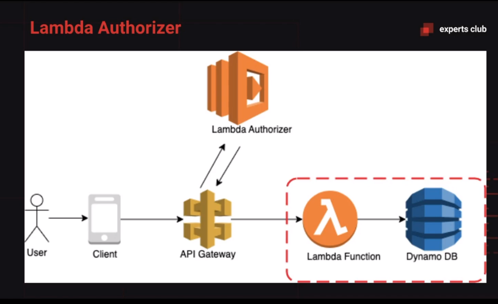

<div align="center" id="top"> 
  

  &#xa0; 
</div>

<h1 align="center">Serverless Lambda Authorizer Jwt</h1>

<p align="center">
  

  

  

  
  
</p>

<p align="center">
  <a href="#dart-about">About</a> &#xa0; | &#xa0; 
  <a href="#sparkles-features">Features</a> &#xa0; | &#xa0;
  <a href="#rocket-technologies">Technologies</a> &#xa0; | &#xa0;
  <a href="#white_check_mark-requirements">Requirements</a> &#xa0; | &#xa0;  
  <a href="#memo-license">License</a> &#xa0; | &#xa0;
  <a href="https://github.com/wsasouza" target="_blank">Author</a>
</p>

<br>

## :dart: About ##

Protect a serverless API in Node that is being exposed in API Gateway with a lambda function, commonly known as Lambda Authorizer.

## :sparkles: Features ##

:heavy_check_mark: Auth JWT with Lambda Authorizer;

## :rocket: Technologies ##

The following tools were used in this project:

- [AWS](https://aws.amazon.com/pt/api-gateway/)
- [Node](https://nodejs.org/en/)
- [Javascript](https://developer.mozilla.org/pt-BR/docs/Web/JavaScript)
- [JWT](https://jwt.io/)

## :white_check_mark: Requirements ##

Before starting :checkered_flag:, you need to have [Git](https://git-scm.com) and [Node](https://nodejs.org/en/) installed.

## :checkered_flag: Starting ##

```bash
# Clone this project
$ git clone https://github.com/wsasouza/lambda-authorizer

# Access
$ cd lambda-authorizer

# Install dependencies
$ yarn


```

## :memo: License ##

This project is under license from MIT. For more details, see the [LICENSE](LICENSE.md) file.


Made with :heart: by <a href="https://github.com/wsasouza" target="_blank">Walter Santos de Andrade Souza</a>

&#xa0;

<a href="#top">Back to top</a>
